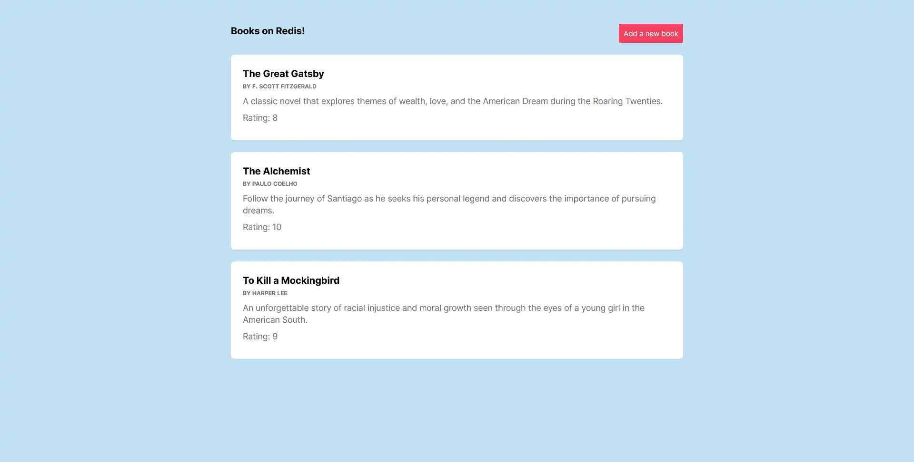

# Redis Core

This is a Practical **Nextjs** project for practicing **Redis Core** with **Node.js**.

## Technologies

- Redis
- Nodejs
- Nextjs 13

## Features

- Connecting to **Redis**
- Adding only **unique** data
- Work with **Hashes**
- Work with **Sorted Sets**
- Getting Data with **Pipeline**

## Installation

First add **.env.local file**. then:

```shell
npm install

node run dev
```

## Screenshots


